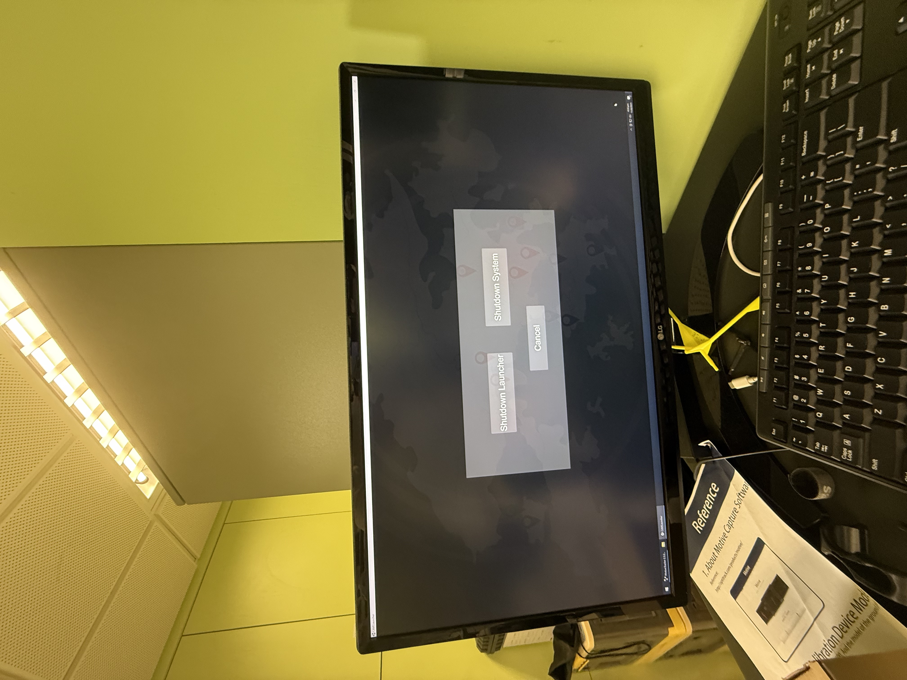

# CAVE Protocol

## Basic 1- How to open it?

The CAVE **MUST** open in order. 

- Turn on the Green Button on Electric Box

- Turn the top two Down Load Boxes and wait the bar loading to Ten

- Turn on the PC 

- Wait whole screen shows the image steadly
- Turn the third Down Load Boxes on

## Basic 2- How to shut down?

- Find the luancher, click the *Shutdown System*

- Turn off the Third Down Load Boxes

- Turn off the top two Down Load Boxes

- Turn off the  Green Button on Electric Box

## Quick Fix: 
###  The display is not rendered correctly:

Possibly reason, you are not start the CAVE system in order. Fix method, refer to [PolyU COMP PC Nvidia Setting reset Quick fix Guide.pdf](doc/PolyU%20COMP%20PC%20Nvidia%20Setting%20reset%20Quick%20fix%20Guide.pdf)

### The sould is too large/small 

Adjust it by rotating the control splin in the third Down Load Boxes.

### The program is open in PC's screen rather than in CAVE 

Adjust seting in the Votanic CAVE seting, make sure the screen index is match

### Tracking is not stable
Re calibrate the system. Refer to [TrackingManual.pdf](doc/TrackingManual.pdf)